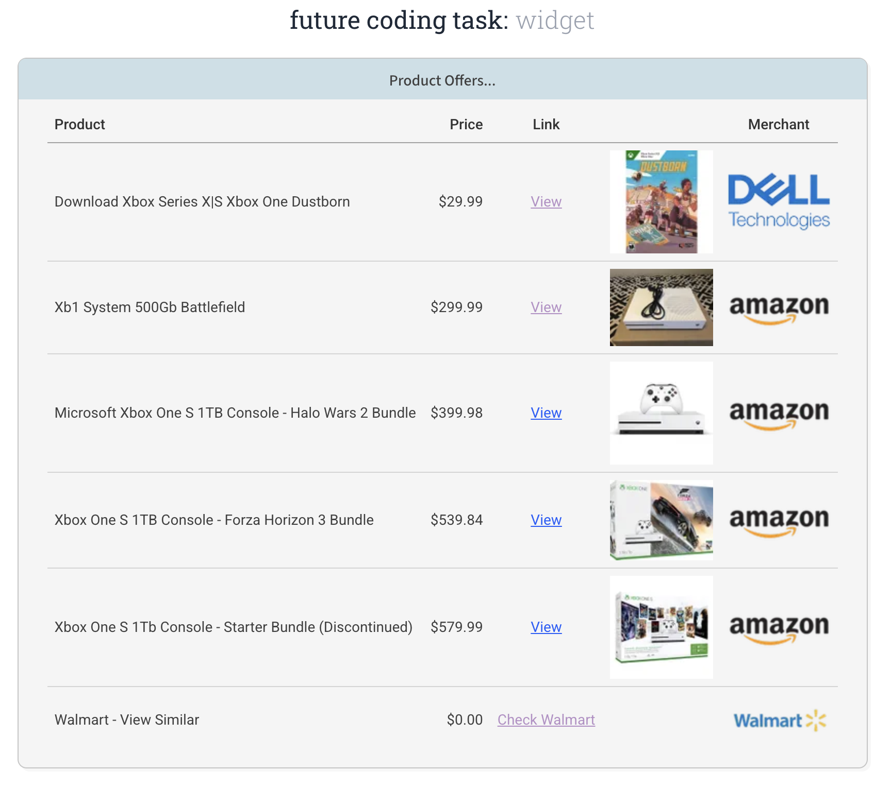

# Future Coding Task | Widget

A test for calling an api endpoint, and showing the result product offers.

For details see 'docs/Coding Interview Task - Widget.pdf'

## Screenshot


### Running (Dev)
To build and run the development server:
```
pnpm run dev
```

Then in a browser (the url shown by vite):
```
http://localhost:5173/
```

### Building (Prod)
```
pnpm run build --base=/widget/
```
This adds the base 'widget' to urls, so assets can be found using an absolute path.

```
http://my-server.local/widget
```

### Testing (Integration)
Tests are written using Vitest & React Testing Library.

To run the unit & integration tests:
```
pnpm test
```

### Testing (End-to-End)

Installed with:
```
%% pnpm create playwright

Inside that directory, you can run several commands:

  pnpm exec playwright test
    Runs the end-to-end tests.

  pnpm exec playwright test --ui
    Starts the interactive UI mode.

  pnpm exec playwright test --project=chromium
    Runs the tests only on Desktop Chrome.

  pnpm exec playwright test example
    Runs the tests in a specific file.

  pnpm exec playwright test --debug
    Runs the tests in debug mode.

  pnpm exec playwright codegen
    Auto generate tests with Codegen.

We suggest that you begin by typing:

    pnpm exec playwright test
```
